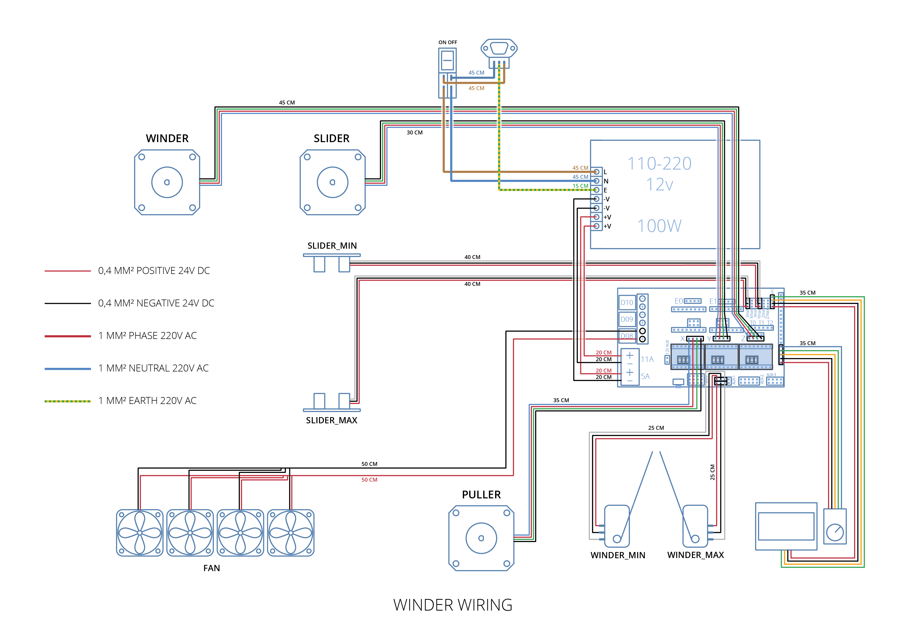

# ecofab
opensource filament extruder

Interrupt_driven_4-1stepper_encoder_accel_rotary_interrupt.ino : Arduino 2560 + Ramps 1.4  Firmware 

](https://github.com/lateliercommun/ecofab/blob/main/wiring%20winder%202.png)
